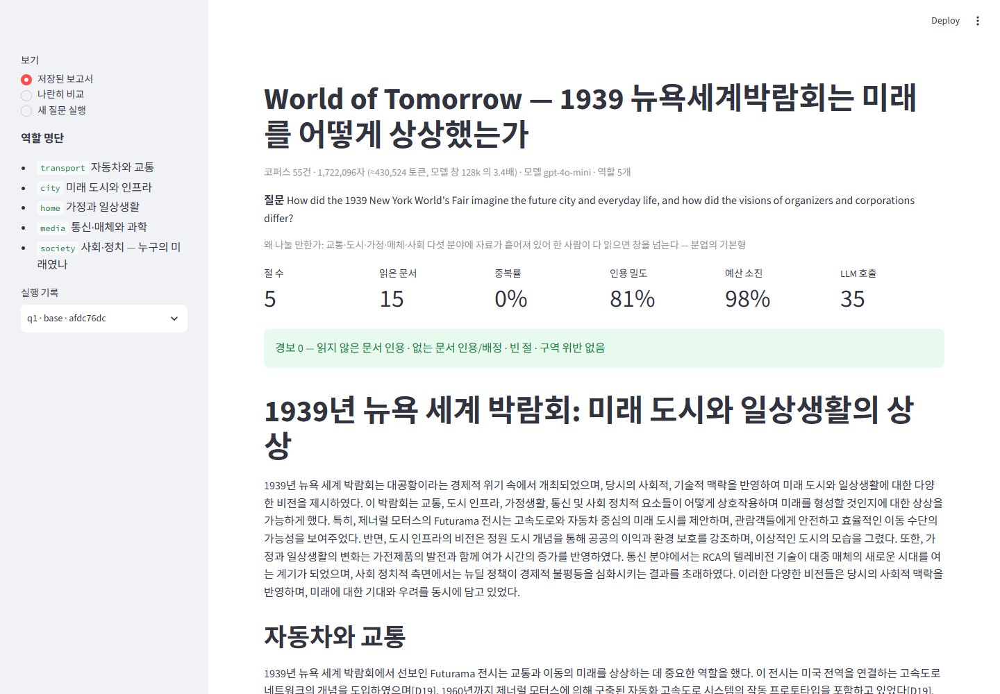
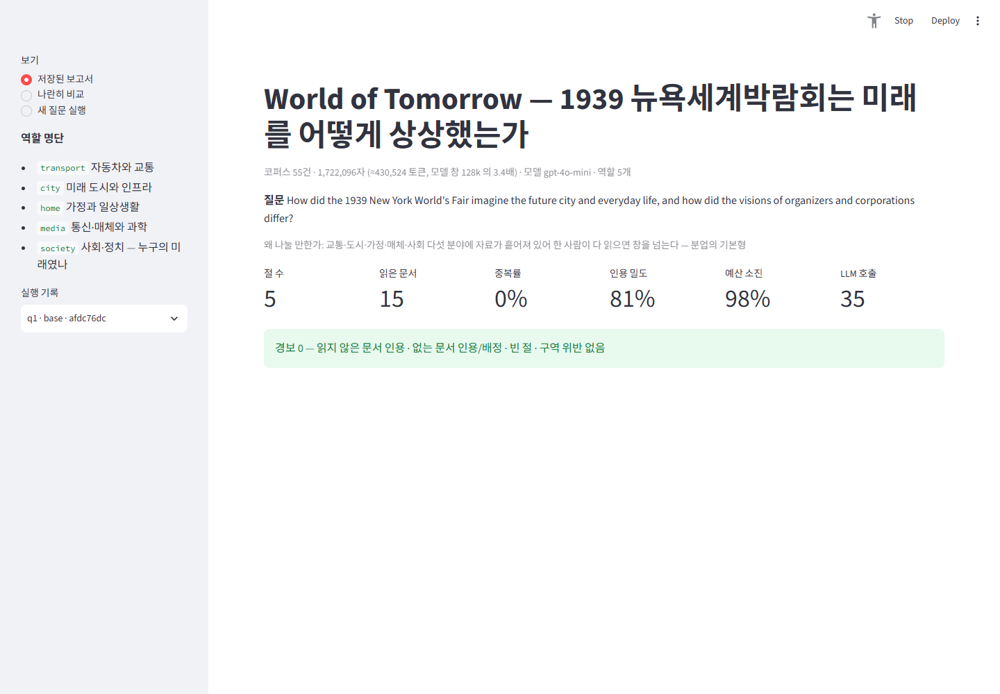
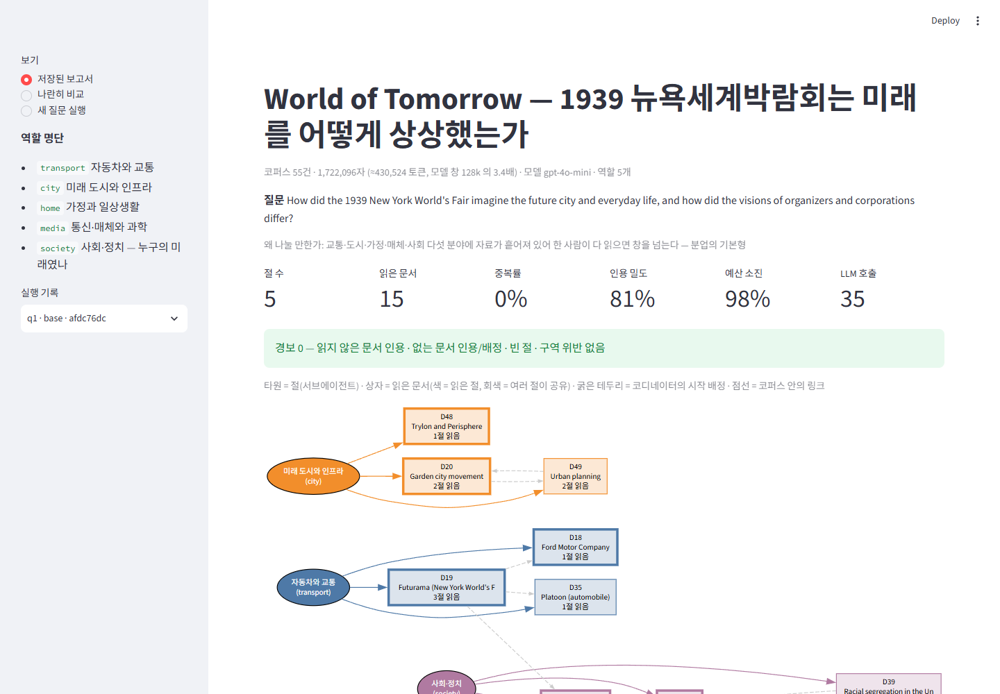
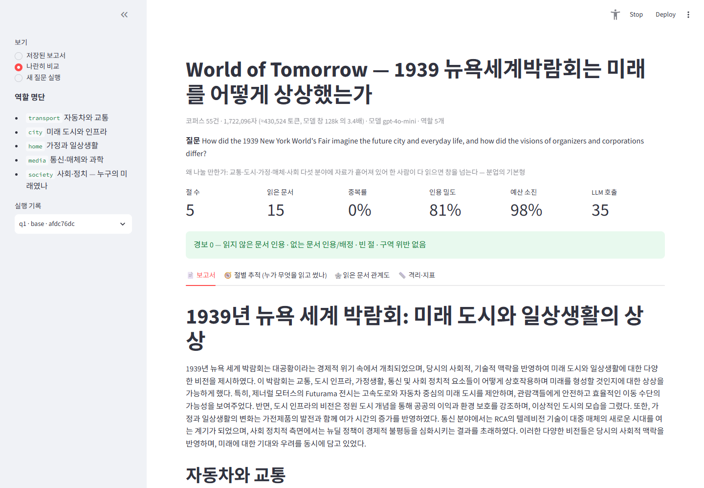

# World of Tomorrow — 딥리서처 에이전트

1939 뉴욕세계박람회는 미래의 도시와 일상생활을 어떻게 상상했는가 — 그리고 그 미래는 누구의 것이었는가.
코디네이터가 **분야별**로 목차를 짜고, 서브에이전트 N명이 각자 자기 구역만 읽고 쓴 원고를 이어 붙여 장문 보고서를 만든다.

- 코퍼스: 영어 위키백과 55건 · 1,799,662자 (≈45만 토큰, gpt-4o-mini 창 128k 의 3.5배) · 코퍼스 내부 링크
- 모델: gpt-4o-mini · 오케스트레이션: LangGraph · 데모: Streamlit
- 설계·실험·판단은 [REPORT.md](REPORT.md)

## 실행

```bash
pip install -r requirements.txt
```

API 키는 환경변수로만 준다 (저장소에 넣지 않는다).

```bash
export OPENAI_API_KEY=sk-...
```

```bash
python collect_corpus.py            # (선택) 코퍼스 재수집 — LLM 호출 없음
python plan_all.py                  # 질문 전체 기획만 (질문당 LLM 1회) → output/plans/
python graph.py q1 --plan           # 한 질문 계획 + 예상 비용 보고
python graph.py q1 --run            # 승인된 계획(output/plans/q1.json)으로 실행
python graph.py q1 --run --off zones  # 스위치 끄고 실행 (zones / validate / recheck)
python baseline.py q1               # 혼자 하는 대조군 (예산 맞춤)
python ablation.py q1 q2 q3 --repeats 2
```

데모:

```bash
streamlit run app.py
```

`OPENAI_API_KEY` 가 없거나 `PUBLIC_MODE=1` 이면 **공개 보기 모드** — 저장된 결과(`output/runs.jsonl`)만 보여 주고 API 를 호출하지 않는다.

## 구조

```
data/corpus.json      docs + links (collect_corpus.py 가 만든다)
data/questions.json   질문 9건 · 유형(single/multi/trace) · "왜 나눌 만한가"
config.json           모델 · 절 수 상한 · 절 예산 · 바퀴 상한 · 스위치 · 역할 명단(구역)
core.py               코퍼스(절 단위 분할) · LLM 계측 · 읽기 루프 (서브에이전트와 대조군이 공유)
graph.py              plan → validate → dispatch(Send) → subagent → check → recheck → merge → synthesize
metrics.py            정답표 없는 지표 — signals / alarms
baseline.py           혼자 하는 대조군 (같은 도구·모델·예산 합계·시작 문서)
ablation.py           스위치를 하나씩 끄고 반복 측정
app.py                데모
plan_all.py           질문 전체 기획만 (배정표 출력)
rerun_baseline.py     대조군만 재실행해 ablation 결과의 baseline 항목 교체
capture.py            README 화면 캡처 (playwright)
output/               plans/ · plans_v1/(프롬프트 수정 전 배정) · runs.jsonl · ablation.json · reports/
                      ablation_v1_buggy/(도구 버그·대조군 예산 미소진이 있던 1차 실험 — REPORT 5-4)
```

## 화면





