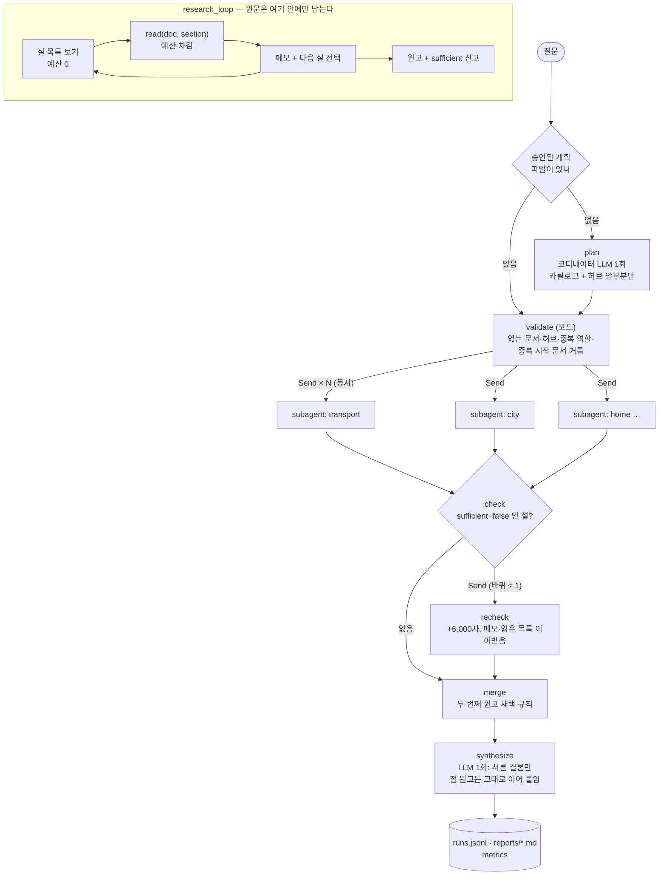
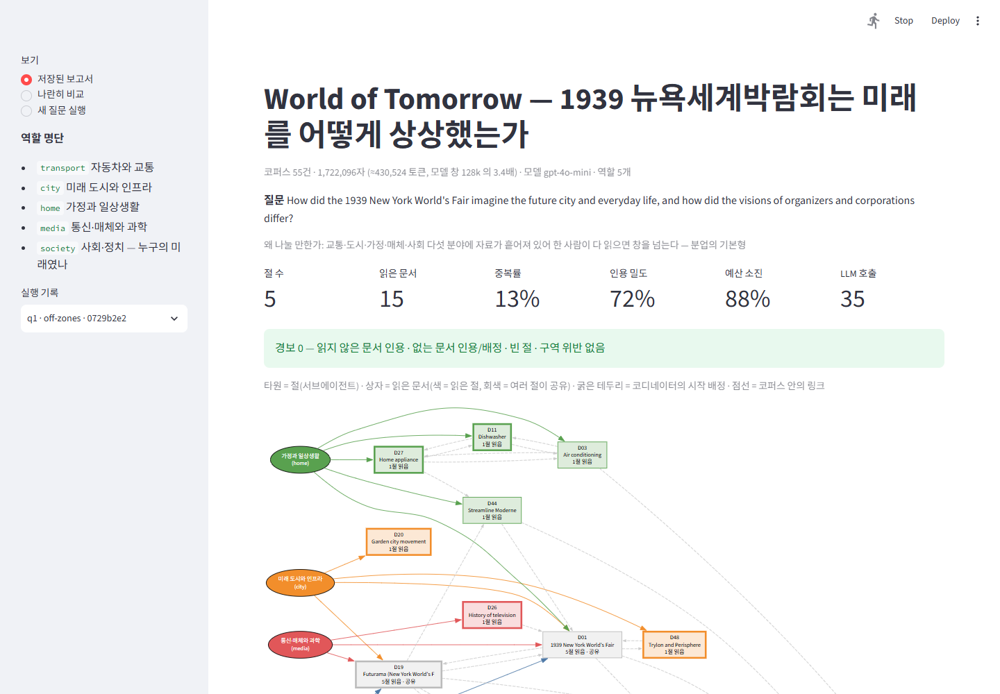

# REPORT — World of Tomorrow 딥리서처

> 1939 뉴욕세계박람회는 미래의 도시와 일상생활을 어떻게 상상했는가 — 그리고 그 미래는 누구의 것이었는가

## 1. 주제와 코퍼스

**왜 이 주제인가.** AI 때문에 미래에 대한 관점이 격변하는 지금, 과거의 사람들이 미래를 어떻게 보았는지, 그리고 그것이 지금과 어떻게 다른지를 다시 보면 우리가 미래를 어떻게 생각해야 할지에 도움이 된다고 봤다. 2차 대전 직전에 열린 1939 뉴욕세계박람회("The World of Tomorrow")는 시기적으로 의미가 있고 자료도 찾기 쉽다. 목표는 전시 목록을 요약하는 것이 아니라, **조직자와 기업이 서로 다른 미래상을 어떻게 제시했고 그 미래가 누구를 포함하고 배제했는지**를 조사하는 것이다.

**코퍼스** (`collect_corpus.py` → `data/corpus.json`, LLM 호출 0회)

| 항목 | 값 |
|---|---|
| 문서 | 영어 위키백과 **55건** |
| 총 글자 | **1,799,662자** (참고문헌 절 제외 1,722,096자) ≈ **45만 토큰** |
| 모델 창 | gpt-4o-mini 128k 토큰 → 코퍼스가 **창의 3.5배**. 한 번에 다 넣을 수 없다 |
| 링크 | 코퍼스 내부 링크(서로 가리키는 관계)만 남김 |
| 들어오는 링크 0 | 10건 (Polish pavilion, Voder, Fluorescent lamp, View-Master, Elsie the Cow, Technocracy movement, Corporate propaganda, Radiant City, Broadacre City, PRR S1) — **링크 탐색으로는 영원히 닿지 못해 배정만이 유일한 경로** |
| 읽기 단위 | 문서가 길어서(최대 25만 자) 문서가 아니라 `== 절 ==` 단위로 읽는다 (문서당 평균 9.7절) |

처음에는 교통·도시·가정·매체 4분야, 42건으로 모았다. 그러다 "사회적 이슈도 담자"는 판단으로 **사회·정치 구역**(대공황, 뉴딜, Flint 파업, 기업 선전, 소비주의, 계획적 진부화, 테크노크라시, Redlining, Levittown, The Power Broker, 인종 분리, Polish pavilion)을 더했다.

**질문 세트** (`data/questions.json`, 9건, 정답표 없음). 질문마다 "왜 나눌 만한가"를 한 줄로 달았다.

| id | 유형 | 질문(요지) | 왜 나눌 만한가 |
|---|---|---|---|
| q1 | multi | 미래 도시·일상을 어떻게 상상했나, 조직자와 기업의 미래상은 어떻게 달랐나 | 다섯 분야에 흩어져 창을 넘는다 |
| q2 | multi | "내일의 세계"는 누구의 미래였나 | 전시 문서와 사회 문서가 다른 구역에 있다 |
| q3 | trace | Futurama → 전후 고속도로·교외 | 한 대상을 따라 교통 → 도시 → 사회로 넘어간다 |
| q4 | multi | 기업의 역할과 대공황 정치·노동 갈등 | 기업 문서와 정치 문서가 갈려 있다 |
| q5 | multi | 실현된 기술과 빗나간 예측 | 분야마다 성패가 다르다 |
| q6 | trace | Robert Moses와 사회적 비용 | 한 인물 추적 — 쪼개면 흐름이 끊길 수 있다 |
| q7 | **single** | Elektro는 무엇인가 | **나눌 이유가 없다** — 이 구조를 쓰면 안 되는 경우 |
| q8 | **single** | Westinghouse 타임캡슐 | **나눌 이유가 없다** |
| q9 | multi | 전쟁과 국제관이 낙관을 어떻게 흔들었나 | 들어오는 링크 0인 Polish pavilion이 배정 없이는 안 읽힌다 |

## 2. 분업 설계

### 목차의 축 = 분야 (내용 단위)
형식(개요·연표·분석)으로 나누면 전원이 같은 허브 문서를 읽는다. 그래서 **분야로 나누고 분야마다 구역(zone)을 미리 정했다** (`config.json › roles`).

| 역할 | 구역 문서 수 | 이 역할이 답할 것 |
|---|---|---|
| `transport` 자동차와 교통 | 10 | Futurama, GM, Bel Geddes, Interstate, 자동운전(Platoon), Streamline… |
| `city` 미래 도시와 인프라 | 10 | Trylon and Perisphere(Democracity), Moses, Garden city, Suburb, Radiant/Broadacre City… |
| `home` 가정과 일상생활 | 11 | Westinghouse, Elektro, 가전, 나일론·DuPont, 형광등, 에어컨… |
| `media` 통신·매체와 과학 | 5 | RCA, 텔레비전사, Voder, 타임캡슐, Einstein |
| `society` 사회·정치 — 누구의 미래였나 | 13 | 대공황, 뉴딜, Flint 파업, Redlining, Levittown, The Power Broker… |
| (공용) | 5 | 1964 박람회, Golden Gate, Century of Progress, Queens Museum, Whalen — 링크로 닿으면 누구나 |
| (허브) | 1 | `1939 New York World's Fair` — **코디네이터 전용**, 서브에이전트에게 주지 않는다 |

### 서브에이전트 설계 규칙
1. **누가 무엇을 보는가 (격리)**
   - 코디네이터: 카탈로그(id·제목·구역·절 제목·들어오는 링크 수)와 허브 문서 앞부분 2,500자만 본다. 본문은 보지 않는다.
   - 서브에이전트: 자기 구역과 공용 문서의 절 본문만 읽는다. **남의 구역은 목록(id)만 알려 주고, 읽으려 하면 코드가 거절한다.**
   - 종합: 원고만 본다. 원문은 보지 않는다.
2. **읽기 루프** (`core.research_loop`)
   - 절 목록은 공짜로 보여 준다. 읽은 절의 글자 수만 예산에서 깎는다(절당 최대 4,000자).
   - 한 번에 한 절씩 읽는다. 읽을 때마다 `[Dxx]`가 붙은 메모를 남기고 다음 절을 고른다. 다음 후보는 시작 문서, 그리고 지금까지 읽은 문서의 링크다.
   - **원문 텍스트는 함수 밖으로 나가지 않는다.** 위로는 원고·메모·읽은 목록만 올라간다.
3. **예산**: 절당 12,000자, 최대 5걸음. 재파견은 +6,000자.
4. **원고**: 한국어 350~600단어. 사실을 담은 문장마다 `[Dxx]` 인용을 달고, 메모에 있는 id만 인용한다. `sufficient`/`missing`을 스스로 신고한다.

### 배정 규칙과 코드 검사 (`graph.validate_node`)
- 코디네이터는 질문에 맞춰 역할을 1~5개 고르고, 절마다 시작 문서를 1~3개 배정한다.
- **코드가 검사하는 것**:
  - 없는 문서 id → 거름. 제목으로 준 경우 → id로 고침.
  - 허브 문서 배정 → 거름.
  - 모르는 역할이나 중복 역할 → 거름.
  - **절 간 시작 문서 중복 → 거름.** 프롬프트로 금지했는데도 모델이 어겨서 코드로 옮겼다(아래 5절 참고).
- `validate` 스위치를 끄면 무효 배정이 그대로 파견되고, 경보 `invalid_dispatched`가 켜진다.

### 점검과 두 번째 원고
- `sufficient=false`로 스스로 신고한 절만 재파견한다. **바퀴 상한은 1**이다.
- 재파견은 이전 메모와 이미 읽은 목록을 이어받는다. 같은 절을 다시 읽지 않는다.
- **두 번째 원고 채택 규칙**: 두 조건을 모두 만족할 때만 교체하고, 아니면 첫 원고를 유지한다.
  - ① 읽지 않은 문서를 인용하지 않았다.
  - ② 인용한 문서 수가 이전 원고보다 줄지 않았다.
- 이유: 무조건 덮어쓰면 인용을 빠뜨린 새 원고가 멀쩡한 첫 원고를 지운다. 두 원고는 모두 기록해 데모에서 나란히 볼 수 있다.

### 종합
절 원고는 **손대지 않고 그대로 이어 붙인다.** LLM에게 다시 쓰게 하면 인용이 엉뚱한 문장으로 옮겨 붙기 쉽다. 종합 LLM은 서론과 결론만 쓴다(결론: 분야 간 비교, 그리고 지금 우리가 AI 시대의 미래를 상상하는 방식과 무엇이 다른가). 호출도 1회로 끝난다.

## 3. 지표 — 정답표도 판정 모델도 쓰지 않는다

만들어진 글과 실제로 읽은 자료만 본다 (`metrics.py`). 문장 분리 규칙은 버전(`v1`)을 붙여 모든 결과에 함께 기록한다. 규칙이 바뀌어서 지표가 좋아진 것처럼 보이는 사고를 막기 위해서다.

| 종류 | 지표 | 한 줄 정의 | 어느 장치를 보는가 |
|---|---|---|---|
| 신호 | `coverage_docs` | 읽은 서로 다른 문서 수 | **분업·배정** — 나눠 읽으면 넓어져야 한다 |
| 신호 | `overlap_rate` | 2개 이상 절이 읽은 문서의 비율 | **구역 알림(zones)** — 켜면 낮아져야 한다 |
| 신호 | `citation_density` | `[Dxx]`가 붙은 문장의 비율 | **서브에이전트 원고** — 메모의 근거가 글까지 올라왔나 |
| 신호 | `budget_utilization` | 쓴 읽기 예산 / 준 예산 | **대조군 공정성** — 낮으면 상대를 묶어 둔 것 |
| 신호 | `chars_coordinator` vs `chars_subagents` | 주체별로 본 원문 글자 수 | **격리** — 코디네이터는 원문을 거의 안 본다 |
| 신호 | `calls`, `prompt_tokens` | 호출 수와 토큰 | **비용** |
| 경보 | `cited_unread` | 그 절이 읽지 않은 문서를 인용 | 서브에이전트 환각 |
| 경보 | `cited_nonexistent` | 코퍼스에 없는 id 인용 | 환각 |
| 경보 | `invalid_dispatched` | 없는 문서가 배정된 채 파견됨 | 배정 검사(validate) |
| 경보 | `empty_sections` | 원고가 빈 절 | 쓰기 실패 |
| 경보 | `zone_violations` | 구역을 켰는데 남의 구역을 읽음 | 구역 규칙 코드 경로가 실제로 도는가 |

한 줄로 설명이 안 되는 지표(예: 워드클라우드, 가독성 점수)는 만들지 않았다. 지표는 **명백한 실패를 거르는 용도**로만 쓰고 순위표로 쓰지 않는다.

## 4. 파이프라인 구조도

**State** (`graph.State`)

| 키 | 누가 쓰나 | 내용 |
|---|---|---|
| `run_id` · `qid` · `question` · `switches` | 입력 | 스위치 `zones` / `validate` / `recheck` |
| `raw_plan` | plan | 코디네이터가 낸 그대로의 배정 |
| `plan` · `plan_check` | validate | 검사를 통과한 배정, 거른 목록, `invalid_dispatched` |
| `sections` (reducer `operator.add`) | subagent × N | 원고·메모·읽은 목록·trace. **원문은 없다** |
| `rechecks` (reducer `operator.add`) | recheck | 두 번째 원고 |
| `final_sections` | merge | 채택 규칙을 적용한 최종 절 |
| `report` | synthesize | 마크다운 보고서 |

주체별로 본 글자 수와 호출 수를 세는 계측기(`Usage`)는 State 밖에 run_id별로 둔다. 병렬 노드들이 같은 계측기에 기록하므로 락을 건다.

## 5. 실험과 결과

### 5-1. 배정 — 프롬프트 규칙은 "부탁"이지 "강제"가 아니다
질문 9건을 기획만 따로 돌렸다(질문당 LLM 1회, 9회 합계 $0.005). 기획 결과는 **실행 전에 사람이 읽고 승인했다.**

| | v1 배정 (`output/plans_v1/`) | v2 배정 (프롬프트 보강 후) |
|---|---|---|
| 한 건짜리 질문 q7·q8 | 스스로 **절 1개** ✓ | 절 1개 ✓ |
| 도시 절의 Democracity(Trylon and Perisphere) | 0/9 — 대신 Broadacre·Garden city·Urban planning 같은 일반 이론 문서 | q1에만 배정 |
| q9의 Polish pavilion (들어오는 링크 0) | 미배정 | **여전히 미배정** → 아무도 못 읽음 |
| q6 Moses 추적 | 무관한 교통 절 추가 | 여전히 3절 + **D43을 두 절에 중복 배정** (금지 규칙 위반) |
| 없는 문서 배정 | 0 | 0 |

- **교훈 1.** 기계적으로 확인할 수 있는 규칙(중복 시작 문서)은 프롬프트로 부탁하지 말고 **코드로 강제**한다. validate에 중복 제거를 넣자 q6의 D43 중복이 바로 걸러졌다.
- **교훈 2.** "Polish pavilion이 전쟁 질문과 관련 있다" 같은 의미 판단은 코드로 강제할 수 없다. **제목만 보는 코디네이터의 한계**이고, 격리를 지킨 대가다. 대안(카탈로그에 문서별 첫 문장 추가)을 쓰면 코디네이터가 보는 원문이 2,117자에서 약 1만 자로 늘어난다. 이번에는 격리 쪽을 택했다.

### 5-2. 격리는 숫자로 (기본 실행)

| 질문 | 절 | 코디네이터가 본 원문 | 서브에이전트가 본 원문 | 호출 |
|---|---|---|---|---|
| q1 | 5 | 2,117자 | 58,647자 | 35 |
| q5 | 5 | 2,117자 | 58,696자 | 35 |
| q6 | 3 | 2,117자 | 35,416자 | 20 |
| **q7 (single)** | 1 | **2,117자** | **1,106자** | 6 |

q7에서는 코디네이터가 본 원문이 서브에이전트가 실제로 읽은 원문보다 많다. **한 건으로 답이 나오는 질문에서는 기획 비용이 읽기 비용을 넘는다.** 이 구조를 쓰면 안 되는 경우가 숫자로 드러난다.

### 5-3. 스위치를 하나씩 끄기 — q1·q2·q3 × 2회 (최종, 버그 수정 후)

`output/ablation.json`. 괄호는 두 번 시행의 최소–최대다.

| q | 설정 | 읽은 문서 | 중복률 | 인용 밀도 | 인용한 문서 | 예산 소진 | 호출 | 입력 토큰 | 경보 |
|---|---|---|---|---|---|---|---|---|---|
| q1 | **base** | 15.0 (15–15) | 0.00 | 0.76 (0.70–0.81) | 13.0 | 0.96 | 35 | 45,672 | 0 |
| q1 | off-zones | 14.5 (14–15) | **0.14** (0.13–0.14) | 0.73 | 12.5 | 0.89 | 35 | 44,157 | 0 |
| q1 | off-recheck | 16.0 (16–16) | 0.00 | 0.71 | 12.0 | 0.94 | 35 | 44,844 | 0 |
| q1 | **대조군** | **7.0** (6–8) | 0.00 | **0.51** | **3.0** | 0.95 | 27 | **58,210** | 0 |
| q2 | **base** | 14.0 (14–14) | 0.00 | 0.79 | 13.5 | 0.96 | 33 | 44,653 | 0 |
| q2 | off-zones | 16.5 (16–17) | **0.09** (0.06–0.12) | 0.73 | 15.5 | 0.98 | 36 | 48,097 | 0 |
| q2 | off-recheck | 14.0 (14–14) | 0.00 | 0.86 | 12.0 | 0.95 | 34 | 45,777 | 0 |
| q2 | **대조군** | **7.0** (6–8) | 0.00 | **0.60** | **5.0** | 0.98 | 27 | **58,329** | 0 |
| q3 | **base** | 5.0 | 0.00 | 0.93 | 5.0 | 0.97 | 15 | 20,650 | 0 |
| q3 | off-zones | 5.0 | 0.00 | 0.89 | 5.0 | 0.97 | 15 | 20,414 | 0 |
| q3 | off-recheck | 5.5 (5–6) | 0.00 | 0.94 | 5.0 | 0.99 | 15 | 21,358 | 0 |
| q3 | **대조군** | 3.5 (3–4) | 0.00 | 0.54 (0.40–0.68) | 3.5 | 1.00 | 10 | 19,148 | 0 |

**무엇이 값을 했나**

- **분업 자체 (base vs 대조군)**: 가장 큰 차이가 났고, 두 번의 시행 모두 같은 방향이었다. 같은 예산(60,000자)을 **다 썼는데도**(95%) 대조군이 읽은 문서는 7건으로 분업의 절반이다. 인용한 문서는 3~5건으로 분업의 1/3이다. 그런데도 **입력 토큰은 30% 더 쓴다.** 혼자 하면 메모가 한 창에 계속 쌓이기 때문이다. 대조군은 Ford와 Garden city 두 문서의 절을 각각 5~7개씩 파고들었다. 넓게 보지 못하고 먼저 잡은 문서 안으로 깊어지는 것이다.
- **구역 알림 (zones)**: 끄면 중복률이 0에서 **0.09~0.14**로 오른다. 중복된 문서는 주로 **허브 문서**(`1939 New York World's Fair`, q1에서는 5명 중 **4명**이 읽음)와 Futurama(3명)였다. 설계 때 "허브가 중복의 주범"이라고 예상한 그대로다. 다만 **커버리지는 줄지 않았다**(q2는 오히려 16.5건). zones가 값을 한 것은 "중복 제거"이지 "넓게 읽기"가 아니다. q3처럼 2절짜리 추적형 질문에서는 차이가 없었다.
- **점검 (recheck)**: **효과를 측정할 수 없었다.** 전체 실행의 모든 절 **162개** 중 스스로 "부족하다"고 신고한 절이 **0개**라서, 재파견 경로가 한 번도 돌지 않았다. on/off 차이(예: q2 인용 밀도 0.79 vs 0.86)는 시행 간 편차 안에 있다. 모델의 자기 신고는 늘 낙관적이다. → 개선점은 7절 참고.
- **배정 검사 (validate)**: 이번 v2 계획에는 없는 문서 배정이 0건이라, 끄고 돌려도 결과가 기본과 같다. 그래서 반복 실험에서 뺐고 비용을 아꼈다. 이 장치의 효과는 두 곳에서 보였다.
  - 모의 실행(비용 0): 지어낸 `D99`를 걸러 냄. 끄면 그대로 파견되고 경보 `invalid_dispatched=1`.
  - q6: 중복 배정 D43 제거.

### 5-4. 에이전트 결과를 의심한 기록 — 두 번 속을 뻔했다

**① 대조군 손발 묶기 (예산 미소진).** 첫 대조군 실행의 예산 소진율이 **62%**였다. 기준선 90%에 못 미쳤다.
- 원인: 걸음 상한(25걸음)이 예산보다 먼저 걸렸고, 그중 7걸음이 없는 절 요청으로 날아갔다. "90%까지 계속 읽기" 코드는 모델이 멈추려 할 때만 작동해서 이 경우를 막지 못했다.
- 수정: 대조군에 한해 예산이 찰 때까지 걸음을 연장했다(최대 2배, 연장 구간에서는 가장 덜 읽은 문서부터 코드가 고름).
- 결과: 소진율 91~100%. 불공정했던 1차 대조군 결과는 `output/ablation_v1_buggy/`에 남겼다.

**② 스위치 효과인 줄 알았는데 도구 버그였다 (zones 끔).** 1차 실험에서 zones를 끄면 커버리지가 13건에서 9건으로 줄고, 가정 절이 읽지 않은 Chrysler[D07]를 **9번 인용**하는 경보가 켜졌다. "구역이 없으면 서브에이전트가 헤맨다"는 그럴듯한 결론이 나올 뻔했다.
- 추적해 보니 그 가정 절은 **한 절도 읽지 못했다.** 메뉴가 `D27 Home appliance: Lead (1200)` 형식이라 모델이 절 이름을 `"Home appliance: Lead"`로 요청했고, 매번 "없는 절"로 거절됐다. 메모가 0개인 채로 원고를 쓰다 보니 인용을 지어냈다.
- 없는 절 요청 비율: 기본 3%, zones 끔 **26%**, 대조군 **30%**. 읽을 수 있는 문서가 넓을수록 메뉴가 길어졌고, 600자에서 잘린 절 이름이 모호해졌다. 즉 **버그가 zones 끔과 대조군에만 불리하게 작용해 분업의 우위를 부풀리고 있었다.**
- 수정: 제목과 절 이름을 분리하고 절 이름에 따옴표를 붙였다. 글자 수가 아니라 절 개수로 자르고, `"제목: 절"` 형태는 코드가 고쳐 받는다.
- 결과: 없는 절 요청 0~2건. zones 끔의 경보는 사라졌고 커버리지 차이도 사라졌다. 남은 차이는 중복률뿐이다.
- **5-3의 표는 수정 후 결과이고, 1차 결과는 순위표로 쓰지 않는다.**

## 6. 결과물을 직접 비교하기 (q1 · base `afdc76dc` vs 대조군 `6b0d7d7b`)

**어느 쪽이 나은가 — 읽는 목적에 비추면 대조군(혼자 쓴 쪽)이 낫다.**

두 보고서를 나란히 놓고 읽었을 때, 분업을 하지 않은 쪽이 가독성이 더 좋고 길이도 적당하며 흐름도 부드럽게 느껴졌다. 분업한 쪽은 전문 분야에서의 구체적인 내용, 특히 예시를 매우 구체적으로 설명한다는 점이 좋았다(Futurama의 5만 대 자동차 모형, RCA의 텔레비전 시연과 FCC 미승인 등). 그러나 이 보고서를 읽는 목적은 하나하나의 구체적이고 자세한 예시가 아니라, **이 주제의 흐름과 결론**이 궁금해서다. 그 목적에서 보면 분업한 결과물은 조금 벗어나 있다.

**지표와 내 판단이 엇갈린다.** 지표로는 분업 쪽이 모든 신호에서 앞선다.
- 읽은 문서: 분업 15건, 대조군 7건
- 인용한 문서: 분업 13건, 대조군 3건
- 인용 밀도: 분업 0.76, 대조군 0.51
- 대조군은 사회와 매체 갈래를 통째로 빠뜨렸다.

그런데도 읽는 사람에게는 대조군이 낫다. 지표를 순위표로 쓰지 말라는 원칙이 왜 필요한지 여기서 확인했다. **지표는 "많이, 근거 있게 읽었나"를 재지만 "읽는 사람의 목적에 맞게 엮었나"는 재지 못한다.**

**왜 분업 쪽의 흐름이 끊기는가 — 원인은 종합 단계의 설계다.**
- 인용이 엉뚱한 문장으로 옮겨 붙는 것을 막으려고, 종합 LLM에게는 서론과 결론만 쓰게 하고 절 원고는 **손대지 않고 이어 붙였다**(2절 "종합"). 그 결과 각 절은 자기 분야 안에서만 완결되고, 절과 절 사이에 "그래서 박람회 전체는 무엇을 말하려 했나"를 잇는 서술이 없다.
- 서브에이전트 원고 지시도 영향을 줬다. "사실을 담은 문장마다 인용을 달라"고 했기 때문에, 해석보다 사실 나열 쪽으로 쏠렸다.
- 반대로 대조군은 한 에이전트가 메모 전체를 보고 한 번에 썼기 때문에 목차와 흐름을 스스로 짰다. 좁게 읽었어도 이야기는 이어졌다.
- 즉 이번 설계는 **인용의 정확성을 지키는 대신 서사를 포기한** 셈이다. 목적(흐름과 결론)에 맞추려면 이 교환 비율을 바꿔야 한다(9절 향후 보완 1번).

참고: 대조군은 한국어로 쓰라는 지시와 달리 **영어로 썼다.** 가독성 판단에 언어 차이가 섞였을 수 있다는 점을 적어 둔다.

**분업 보고서에서 마음에 안 드는 대목과 그 출처**

| 대목 | 어느 절 | 어디서 비롯됐나 |
|---|---|---|
| "1980년대 가전 산업은 연간 15억 달러…", "식기세척기 역사는 1850년…" — 박람회와 무관한 가전 일반사 | 가정 | **코디네이터 배정.** 시작 문서가 `Home appliance`·`Dishwasher` 같은 일반 문서였고, 박람회 전시를 직접 다룬 Westinghouse(D54)·Elektro(D13)는 한 번도 읽히지 않았다. 서브에이전트는 배정받은 문서를 성실히 요약했을 뿐이다 → **고칠 곳은 배정** |
| "도시 계획은 공공 복지, 효율성…을 중시하며[D49]" — 교과서식 정의 | 도시 | 같은 원인. `Urban planning`(D49) 일반 문서가 시작 배정에 들어갔다 |
| "RCA는… 1908년 캠벨-스윈턴은…" 텔레비전 기술 전사 | 매체 | `History of television`(10만 자)의 앞쪽 절을 읽음. 긴 일반 문서가 예산을 먹는다 |
| "박람회는 뉴딜 정책의 결과물로 볼 수 있다" | 사회 | **서브에이전트의 해석 비약.** D30(뉴딜) 원문에는 박람회 언급이 없다. 사회 구역에 박람회와 사회 문제를 직접 잇는 문서가 없다는 **코퍼스의 한계**이기도 하다 |

결론 절의 "오늘날 AI 시대의 미래 상상과의 비교"는 원고에 없는 내용을 종합 LLM이 일반론으로 채운 것이다. 인용이 없고, 인용이 없어야 맞다. 지금의 AI 담론은 코퍼스에 없기 때문이다.

**인용이 제자리에 붙었는지 원문 대조** (코드는 "읽은 문서인가"만 본다. 아래는 사람이 본 것)

| 문장 | 인용 | 원문 | 판정 |
|---|---|---|---|
| (분업·교통) "매일 30,000명 이상의 방문객을 끌어모았다" | D19 | Reception 절: "More than 30,000 persons daily, the show's capacity" | ✅ 맞음 |
| (분업·도시) "Perisphere 내부에는… Democracity가 설치되어" | D48 | Lead: "The Perisphere housed a diorama by Henry Dreyfuss called Democracity" | ✅ 맞음 |
| (분업·교통) "1960년까지 GM이 구축한 자동화 고속도로 시스템의 작동 프로토타입을 **포함하고 있었다**" | D19 | Overview: "automated highway system of which General Motors built a working prototype **by 1960**" — 전시에 포함된 게 아니라 나중에 GM이 만들었다는 뜻 | ❌ **뜻 왜곡** (문서는 맞고 문장이 틀림) |
| (대조군) "the fair also highlighted the garden city movement" | D20 | Garden city movement 문서에는 1939 박람회 언급이 **한 번도 없다** | ❌ **엉뚱한 문장에 붙은 인용** |

두 ❌ 모두 `cited_unread` 경보로는 잡히지 않는다. 읽은 문서를 인용했기 때문이다. **경보 0은 "근거가 맞다"가 아니라 "명백한 실패는 없다"는 뜻일 뿐이다.**

## 7. 데모 설계

`streamlit run app.py`. 화면 캡처는 `docs/`에 있다.

| 화면 | 보여 주는 것 | 신경 쓴 점 |
|---|---|---|
| 상단 지표 줄 | 절 수 · 읽은 문서 · 중복률 · 인용 밀도 · 예산 소진 · 호출 + **경보 박스** | 경보는 0이면 초록, 하나라도 있으면 빨강으로 이름과 개수를 보인다. 숫자는 순위가 아니라 실패 탐지용 |
| 📄 보고서 | 최종 장문 + 인용 문서 목록 | 절 원고가 그대로 이어 붙은 모습 |
| 🧭 **절별 추적** | 절마다: 맡은 질문, 시작 배정, **알려 준 남의 구역**, 읽은 순서(문서·절·글자·고른 이유·거절 사유), 위로 올라간 메모, 올린 원고와 자기 신고, 재파견 시 첫/두 번째 원고 비교 | "숫자만 보여 주는 화면은 요점을 놓친다" — **누가 무엇을 읽고 무엇을 썼는지**를 원고 옆에 나란히 두어, 마음에 안 드는 대목을 바로 그 절이 읽은 자료까지 따라갈 수 있게 했다 (6절의 표를 이 화면으로 찾았다) |
| 🕸 **읽은 문서 관계도** | 타원=절(서브에이전트), 상자=읽은 문서(색=읽은 절, **회색=여러 절이 공유**), 굵은 테두리=코디네이터 시작 배정, 점선=코퍼스 링크 | 분업의 모양이 한눈에 보인다. zones를 끈 실행에서는 허브 문서가 회색으로 여러 절에 묶인다 (`docs/screen_graph_offzones.png`) |
| 📏 격리·지표 | 주체별로 본 원문 글자 수 막대 | 코디네이터 2,117자 vs 서브에이전트 수만 자 — 격리를 숫자로 |
| 나란히 비교 | ablation 표(시행 간 최소–최대 포함) + 같은 질문의 두 실행 보고서를 좌우로 | 한 번 돌린 결과로 단정하지 않도록 범위를 함께 보인다 |
| 새 질문 실행 (로컬 전용) | ① 계획 세우기(LLM 1회) → **계획표와 예상 호출·토큰·비용** → ② 승인하고 실행 | "API 사용량 최소" 요구를 화면 흐름으로 옮겼다. 승인한 계획이 그대로 실행되고, 실행 때 다시 기획하지 않는다 |
| 공개 보기 모드 | `OPENAI_API_KEY`가 없거나 `PUBLIC_MODE=1`이면 실행 메뉴가 사라지고 저장된 결과만 보인다 | 평가자가 접속해도 API 요금이 나가지 않는다 |

## 8. 비용

| 항목 | 실행 | 호출 | 비용 |
|---|---|---|---|
| 코퍼스 수집 | — | 0 (위키백과 API만) | $0 |
| 기획 v1 + v2 | 18 | 18 | $0.011 |
| 모의 테스트 | 10+ | 0 (가짜 LLM) | $0 |
| 1차 실험 (버그 포함, 보존) + 대조군 재실행 | 28 | 768 | $0.27 |
| 최종 실험 + 기본 실행(q4~q9) | 30 | 759 | $0.27 |
| **합계** | **58 실행** | **1,545** | **≈ $0.55** |

사전 보고한 상한($0.7) 안에서 끝났다. 가장 크게 아낀 장치는 네 가지다.
- 승인한 계획을 재사용해 실행마다 기획을 다시 하지 않았다.
- 절 단위로 읽고 절 목록은 예산에 넣지 않았다.
- 종합은 서론·결론만 쓰게 했다.
- 효과 없는 실행(validate 끔)을 뺐다.

## 9. 회고

**가장 공들인 부분.** 실험을 공정하게 만드는 일이었다. 코드를 짜는 것보다 **결과를 의심하는 데** 시간이 더 들었다. 두 번의 사고(대조군 예산 미소진, 도구 버그가 스위치 효과로 보인 것)는 모두 "지표가 그럴듯하게 좋다"에서 시작했다. 각 설정의 예산 소진율과 거절 사유를 따로 세어 보지 않았다면 틀린 결론을 REPORT에 썼을 것이다. 서브에이전트와 대조군이 **같은 `research_loop`를 공유**하게 한 설계 덕분에, 버그를 한 곳에서 고치면 양쪽이 똑같이 고쳐졌다.

**배운 것**
- 목차의 축이 곧 결과물의 모양이다. 분야로 나누자 대조군이 통째로 빠뜨린 사회·매체 갈래가 보고서에 들어왔다.
- 결과물의 약점은 대부분 **서브에이전트가 아니라 배정**에서 왔다(가정·도시 절의 일반론). 코디네이터가 제목만 본다는 격리 조건이 배정 품질의 상한을 정한다.
- 프롬프트로 부탁한 규칙은 어겨진다. 확인할 수 있는 것은 코드로 옮긴다.
- 자기 신고(`sufficient`)는 믿을 수 없다. 162개 절 중 부족 신고가 0개였다.
- **분업은 "읽기"를 넓혀 주지만 "쓰기"의 흐름까지 보장하지는 않는다.** 지표상으로는 분업이 모든 면에서 앞섰지만, 직접 읽어 보니 주제의 흐름과 결론을 원하는 목적에는 혼자 쓴 보고서가 더 맞았다. 분업의 이득은 서브에이전트가 읽는 단계에서 나오고, 그 이득을 독자에게 전달하는 일은 종합 단계가 맡는다. 이번에는 종합이 가장 약한 고리였다.

**향후 보완**
1. **종합 단계를 다시 설계한다 — 이어 붙이기에서 엮어 쓰기로.**
   - 서브에이전트에게 긴 원고 대신 "핵심 주장 3개 + 근거 인용 + 다른 분야와 이어질 지점"을 짧게 올리게 한다.
   - 종합 LLM이 그것만 보고 질문에 맞춘 목차와 흐름으로 본문 전체를 쓴다. 구체적 예시는 주장을 받치는 만큼만 남긴다.
   - 인용이 옮겨 붙는 위험은 코드로 막는다. 종합본의 인용이 올라온 주장의 인용 안에 있는지 검사한다.
   - 이 안과 지금 안(이어 붙이기)을 ablation으로 비교하되, 지표만이 아니라 **직접 읽고 흐름을 판단한다.**
2. **점검을 자기 신고가 아니라 코드 조건으로 건다.** 예: 인용 문서 2개 미만, 읽은 절 중 박람회 언급이 0인 절, 메모 수 미달. 그러면 recheck 스위치의 효과를 처음으로 잴 수 있다.
3. **배정 품질 개선.** 카탈로그에 문서별 첫 문장을 넣는 안(격리 비용 약 +8천 자)과 현재 안을 ablation으로 비교한다. 들어오는 링크 0인 문서는 코드가 "관련 후보"로 따로 보여 준다.
4. **코퍼스 보강.** 박람회 안의 배제(흑인 고용 차별 시위, 국제관 철수 등)를 직접 다룬 자료가 위키백과에 부족하다. 사회 절의 해석 비약을 줄이려면 박람회 자체의 사회사 문서가 필요하다.
5. **반복 수를 늘린다.** 지금은 2회씩이다. 중복률·인용 밀도는 시행 간 수 %p씩 움직이므로 방향만 말할 수 있고 크기는 말할 수 없다.
6. 대조군의 출력 언어를 강제한다(JSON 필드로 언어 검사).
